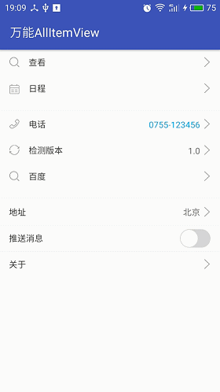

# AllItemView
## 万能的ItemView ##

考虑到每个APP都会用到一些常用的功能，比如，个人资料、关于、检测更新、设置以及各种列表
然而基本上这些功能的样式都是一个itemview,所以分装一个万能的itemview的必要性显得尤为重要

**支持的样式**

  icon（本地或阿里巴巴iconfont位图）、标签、标签值、箭头、切换开关等任意组合，（后续考虑实现输入框的一些功能，和自定义样式）

**功能**

  0.  基本功能（icon、标签、标签值、箭头的任意组合）
  1.  电话
  2.  版本更新（目前点击更新需要自己实现，后续版本添加上去）
  3.  跳转到网页
  4.  选择弹框
  5.  切换开关
  6.  跳转到指定不带参数Activity

**效果**

**实现**

1. **Add it in your root build.gradle at the end of repositories**

	    allprojects {
		repositories {
			...
			maven { url 'https://jitpack.io' }
		}
	    }

2. **Add the dependency**

	    dependencies {
	        compile 'com.github.codbking:AllItemView:v1.0.0'
	    }

3. **xml**

        <com.codbking.view.ItemView
        android:layout_width="match_parent"
        android:layout_height="wrap_content"
        app:ItemView_text="关于"
        app:ItemView_type="activity"
        app:ItemView_acname="com.codbking.allitem.exaple.AboutActivity"/>

4. **权限**

    <uses-permission android:name="android.permission.CALL_PHONE"/>
    <uses-permission android:name="android.permission.INTERNET"/>
    <uses-permission android:name="android.permission.WRITE_EXTERNAL_STORAGE"/>
>

